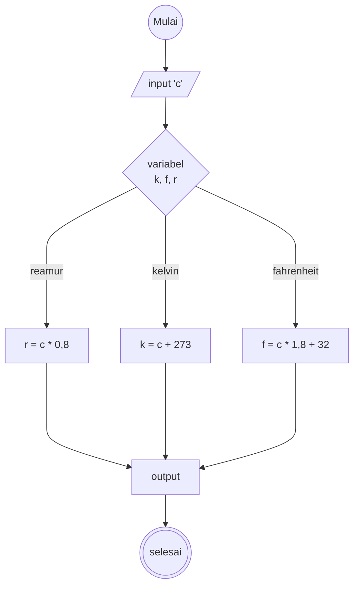

# Algoritma konversi suhu
1. Mulai
2. Masukkan suhu dalam Celcius
3. hitung suhu dalam skala celcius ke Fahrenheit 
4. T = 9/5 T derajat celcius + 32
5. cetak hasil konversi suhu ke Fahrenheit
6. selanjutnya hitung suhu dalam skala Celcius ke Reamur
7. T = 4/5 T derajat R
8. cetak hasil konversi suhu ke Reamur
9. selanjutnya hitung suhu dalam skala Celcius ke Kelvin
10. T (K) = T derajat C + 273
11. cetak hasil konversi suhu ke Kelvin  
12. Selesai

# Flowchart

