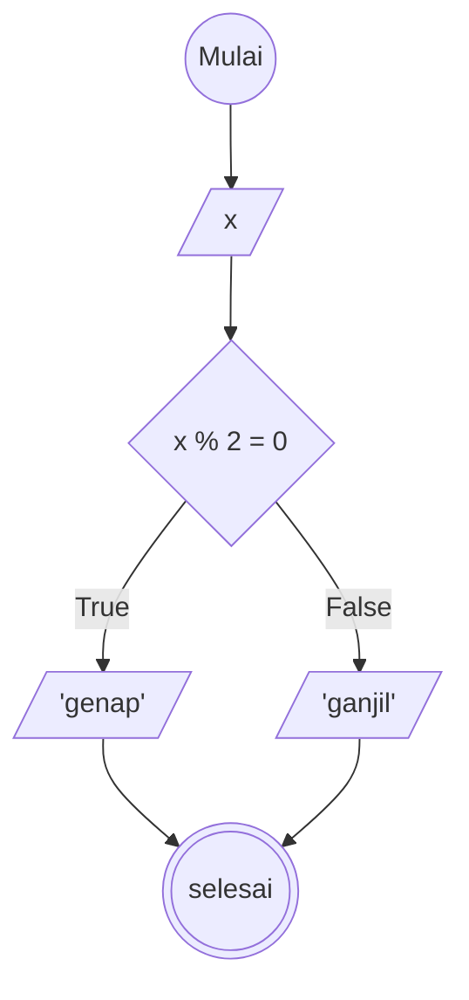

# Menentukan Bilangan Ganjil atau Genap
1. mulai
1. tentukan angka yang ingin digunakan
1. jika angka habis dibagi dengan 2 maka itu bilangan genap
1. jika angka tidak habis dibagi dengan 2  maka itu bilangan ganjil
1. selesai

# Flowchart


# Pseudocode
```
// Bilangan Ganjil Genap
DECLARE x: INTEGER

INPUT x

IF x % 2 == 0 Then 
    OUTPUt "x adalah Bilangan Genap"
ELSE 
    OUTPUt "x adalah Bilangan Ganjil"
ENDIF

```