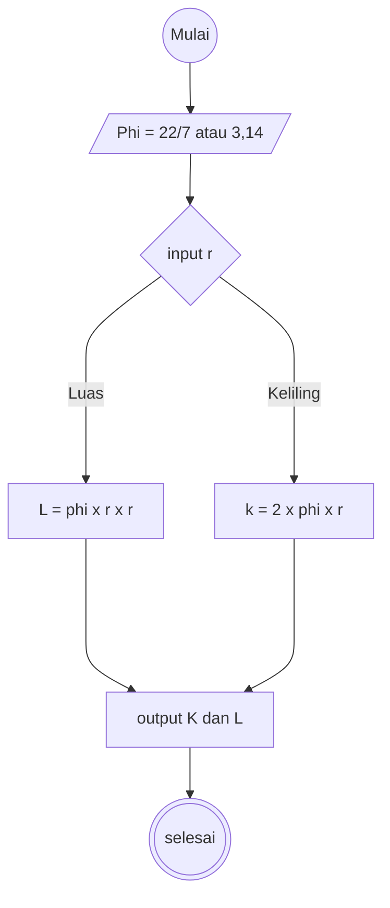

# Menghitung Luas dan Keliling Lingkaran
1. mulai
2. pertama tama kita hitung luas lingkaran terlebih dahulu
3. dengan menggunakan rumus luas lingkaran = phi x r x r
4. phi = 22/7 atau 3,14
5. r = jari jari lingkaran
6. kalikan angka angka tersebut seperti rumus yang ada
7. tampilkan hasilnya
8. selanjutnya kita hitung keliling lingkaran
9. dengan menggunakan rumus keliling lingkaran = 2 x phi x r
10. 2 = adalah rumus keliling lingkaran
11. phi = 22/7 atau 3,14
12. r = jari jari lingkaran
13. kalikan angka angka tersebut sesuai rumus yang ada
14. tampilkan hasilnya
15. selesai

# Flowchart


# Pseudocode
```
// Lingkaran
DECLARE Luas: REAL
DECLARE Keliling: REAL
DECLARE Type: REAL

INPUT Phi
INPUT Type

IF type == Phi
    Result <- phi x r x r
ENDIF
IF type == Phi
    Result <- 2 x phi x r
ENDIF

OUTPUt "hasil konversi Luas adalah:", Result 
Output "hasil konversi Keliling adalah:", Result

```